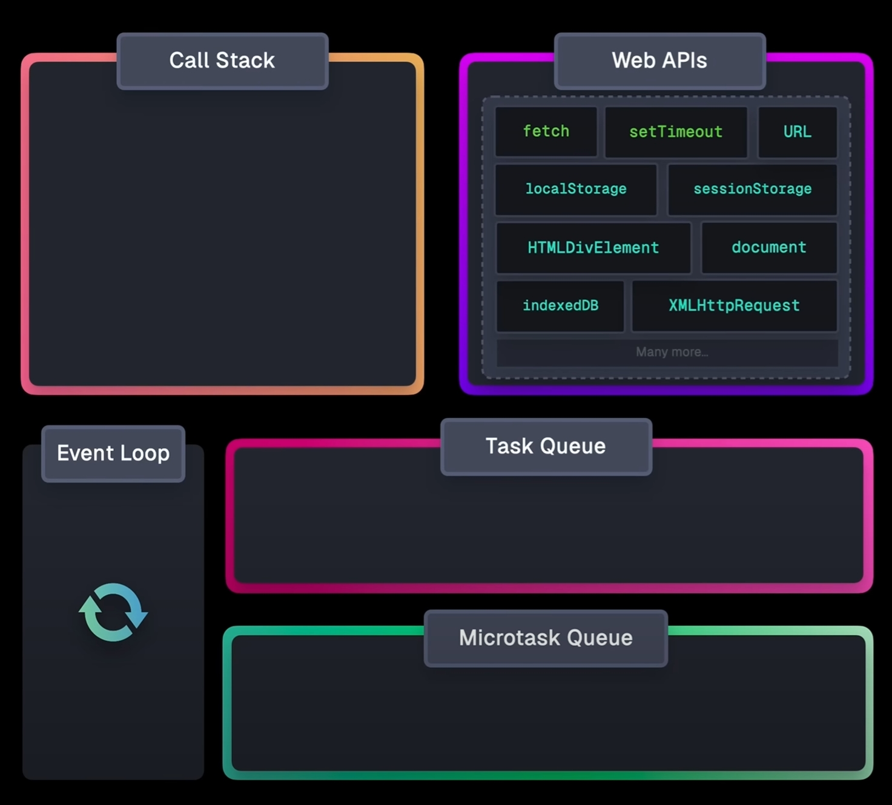

# JavaScript Interview Question

## Explain the concept of "hoisting"

Hoisting a Javascript mechanism where variable and function are move to the top of the scope during the compiler phase. Use different keyword behave differently when hoist.

- use `var` to declare variable, the value of the variable is `undefined` if accessed before initialization.
- use `let` or `const` to declare variable, accessing them results in `ReferenceError` until the actual declaration is encountered.
- use `var` to declare function, The value of the variable is `undefined` if accessed before initialization.
- use `function` to declare function, Both declaration and definition are fully hoisted.
- Class declaration `class` Accessing them results in ReferenceError until the actual declaration is encountered.
- Import declaration `import` Declarations are hoisted, and side effects of importing the module are executed before the rest of the code.

## Explain how `this` work in JavaScript

`this` keyword is the dynamic reference of the context in which the function executed.
The value of `this` keyword depends on how the function is called, not where it is defined.

- If the `new` keyword is used when calling the function, meaning the function is used as a function constructor, the `this` inside the function is the newly created object instance.
- if `this` is used in a `class` `constructor`, the `this` inside the `constructor` function is the newly create object instance too.
- if a function invoked using `.call()`, `.apply()` or `bind()`, `this` inside the function refers to the object passed as the argument.
- If a function called as a method, like `obj.method()`, `this` is refers to the object that the function is a property of.
- If a function is invoked as a **free function invocation**,
  - In non-strict mode, `this` default refer to global context, `window` in browser and `global` in Node.js.
  - In strict mode, `this` is `undefined`.
- For an arrow function, it follows a different rule, `this` refers to the surrounding scope at the time it is created.

## What is the event loop in JavaScript runtimes?



Components in event loop:

1. Call Stack: Keeps track of function calls. When a function is invoked, it is pushed onto the stack. When the function finishes execution, it is popped off.
2. Web APIs: Provides browser features like setTimeout, DOM events, and HTTP requests. These APIs handle asynchronous operations.
3. Task Queue (Callback Queue): Stores tasks waiting to be executed after the call stack is empty. These tasks are queued by setTimeout, setInterval, or other APIs.
4. Microtask Queue: A higher-priority queue for promises and MutationObserver callbacks. Microtasks are executed before tasks in the task queue.
5. Event Loop: Continuously checks if the call stack is empty and pushes tasks from the microtask queue or task queue to the call stack for execution.

Types of Tasks in JavaScript

1. Synchronous Tasks: Executed immediately on the call stack (e.g., function calls, variable declarations).
2. Microtasks: High-priority asynchronous tasks, such as Promise callbacks and queueMicrotask.
3. Macrotasks: Lower-priority asynchronous tasks, like setTimeout, setInterval, and DOM events.

Synchronous Tasks -> Call Stack

Microtask -> Microtask Queue

MacroTask -> Task Queue

How it work:

1. JavaScript executes code synchronously line by line in a single thread, managed by the call stack.
2. If an asynchronous task is encountered (e.g., fetching data from the internet, `setTimeout`), it is passed to Web APIs, which handle it in the background.
3. Once the async task finishes, its callback is queued — either in the Microtask Queue or Task Queue, depending on the type.
4. After the current call stack is empty:

   - All microtasks are executed (until the microtask queue is empty).
   - Then, the first macrotask from the **task queue** is executed.

5. The event loop repeats this cycle indefinitely

## First order function vs higher order function

higher order function: Takes one or more functions as arguments and return a function as its result

```javascript
const numbers = [1, 2, 3, 4];
const doubled = numbers.map((num) => num * 2); // map takes a function
```

First order function: does not take another function as an argument and does not return a function.
